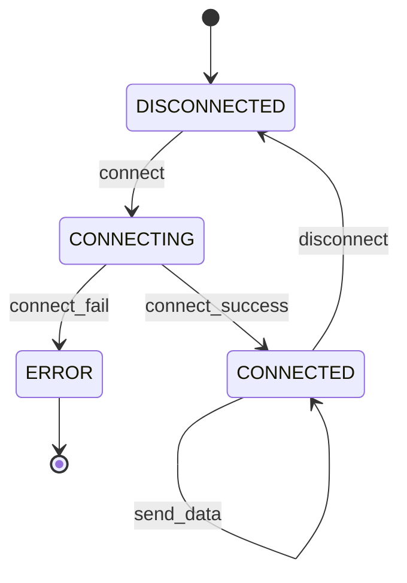

How generators can be used in four ways (from simple to complex):

1. Lazy-like expressions, including unbounded sequences
2. Alternating control flow with the caller
3. **A "pure-looking" function, with hidden internal state**
4. **Internally managing a state-machine, that handles caller-passed input**

The first two use cases are covered [this previous article](/blog/python-generators-part1), and serve as a primer to the topic.
If you don't have a solid understanding of generators in Python, I would recommend starting there.

The second two use cases are covered in this article.

:::info
Well that's a big gap in time between these two articles!

A peak behind the screen -- I speed wrote the first article and outlined the
second, immediately after doing some small projects and consuming some related
tech talks. This past month I was able to clean up this section, and finally
click publish on both!
:::

---
## Functions Internally Handling State

Both the previous use cases are common ones, made more concise through generators.
This use case and the next are less common use cases that are less about convenience, and more becoming **possible** with generators.
(Okay okay, that's not a challenge... There are definitely other ways to construct this logic! But I think these particular formations make me thankful for the tool.)

<!-- truncate -->

In a generalization from use case one, the internal state of a generator function is useful for more than just sequence-like behavior.
Although the most basic case of a generator is an iterator, which lends itself to sequence-like structures, it turns out to be very useful for other logic,
where some internal state that was mutated in between logical steps can now be encapsulated entirely into the function structure.

As a quick example of that "internal state," consider calculating a moving average.
There's a logical dependency between each step on all previous.
Generators will track solely that dependency, and leave the caller with their `Iterator` output:

```python
import time
from collections.abc import Iterable, Iterator
from typing import Union

def moving_average(data: Iterable[Union[int, float]]) -> Iterator[float]:
    _total = 0.0
    _count = 0
    for item in data:
        _total += item
        _count += 1
        yield _total / _count


# To the caller, it just looks like an Iterator
print(list(moving_average([0, 7, 11, 8, 77])))

# And the abstraction still lets the caller proceed lazily if necessary
start_time = time.time()
average = 0
# 50 ms of moving average across some distribution
for average in moving_average(rand_int()):
    if (time.time() - start_time) * 1000 > 10:
        break
    print(average)
```

That's fine and well, maybe the shortest way to write that, but that only feels like a pure function if we're always casting the Iterator back to a list.

But something is missing from that code... What is the `next_rand_int` function?
Well I guess we want a different random number any time that function is called.
In fact, for a lot of randomness you might want that to be both deterministic for your application trace, and still random for all disparate callers.
The normal way to accomplish this is to feed the previous random as the following seed, but that requires all callers knowing if any other caller changed the seed.
The standard library achieves this with an instance of the `random.Random` class, which manages state for you.
In that case though, it can feel like you need a singleton or mono pattern for every code trace to get access to the same object instance.

Instead, we can just encapsulate the random state in our helper function:

```python
from random import Random

MAX_RAND = 1 << 10
def rand_int(max_int=MAX_RAND) -> Iterator[float]:
    r = Random(8)
    while True:
        yield r.random() * max_int
def next_rand_int(max_int=MAX_RAND) -> float:
    return next(rand_int(max_int))

# And with our previous example...
start_time = time.time()
element = 0
for element in moving_average(next_rand_int()):
    if (time.time() - start_time) * 1000 > 10:
        break
    print(element)
# We now see the uniform distribution here:
assert abs(element - MAX_RAND / 2) < 1
```

:::info
It's important to note this is obviously **not** a truly pure function, as calling it with the same input will return different outputs.
As a programming paradigm though, it feels *closer* to functional than using a singleton pattern to host a `Random` instance.
When I before mentioned a "pure-looking function, with hidden internal state," that probably sounded oxymoronic.

What I'm calling "closer to functional" is maybe an implicit feeling that there is "program state," and then there is "world state," and **when functional paradigms are most helpful is when they eliminate the program state**.
When they feel obtuse and frustrating is often when they run up against the realities of hardware and the world state.

For several reasons, randomness feels like it belongs in that second category, alongside the system clock, runtime performance, and other realities of hardware.
The most pressing reason is that for a production release of your application, you may need to opaquely switch the `next_rand_int` implementation out with a [platform specific implementation](https://en.wikipedia.org/wiki/List_of_random_number_generators#Random_number_generators_that_use_external_entropy), or even one of [extremely high entropy](https://en.wikipedia.org/wiki/Hardware_random_number_generator), and that *actually will be* reliant on world state and the realities of hardware.
:::

Just to quiet the functional nerd in me (and maybe in you), here is a useful example that actually does simplify a pure function implementation:

```python
from typing import Iterable, Tuple

def run_length_encoding(data: str) -> str:
    def grouped(i: Iterable) -> Iterable[Tuple[int, str]]:
        iterator = iter(data)
        try:
            _group = next(iterator)
            _count = 1
        except StopIteration:
            return

        for item in iterator:
            if item == _group:
                _count += 1
            else:
                yield (_count, _group)
                _group = item
                _count = 1

        yield (_count, _group)

    groups = grouped(data)
    return "".join(map(str, grouped(data)))

print(run_length_encoding(
    "WWWWWWWWWWWWBW"
    "WWWWWWWWWWWBBB"
    "WWWWWWWWWWWWWW"
    "WWWWWWWWWWBWWW"
    "WWWWWWWWWWW"
))
```

---
## Internally Managing a State Machine with Caller-Passed Input

Finally, the most general abstraction with generators is achieved when we bring in the `generator.send(...)` functionality.
In other languages, this functionality is called a [coroutine](https://en.wikipedia.org/wiki/Coroutine), but in Python that term is overloaded already with constructs from the `asyncio` module, so best to just referred to this as "generators with dot send."

Sending is the opposite of yielding.
When we use a generator, upon pausing the function frame and yielding control to the caller, we can yield some data along with that action.
Sending occurs when we resume the function frame, and along with that action we can also send along some data.
As a result, internal to the function implementation we could be controlling the state of the state machine, and each transition is eating some portion of the input as officiated by whatever the caller `.send()`'s:

```python
from typing import Any, Callable, Generator
from functools import wraps

def primed_coroutine(
    func: Callable[..., Generator[Any, Any, Any]],
) -> Callable[..., Generator[Any, Any, Any]]:
    @wraps(func)
    def start(*args, **kwargs):
        cr = func(*args, **kwargs)
        next(cr)
        return cr

    return start

ConnectionState = Literal["DISCONNECTED", "CONNECTING", "CONNECTED", "ERROR"]
ConnectionEvent = Literal["connect", "connect_success", "connect_fail", "send_data", "disconnect"]
@primed_coroutine
def connection_handler():
    state: ConnectionState = "DISCONNECTED"
    while True:
        event: ConnectionEvent = yield state
        print(f"State: {state}, Event: {event}")

        match (state, event):
            case ("DISCONNECTED", "connect"):
                state = "CONNECTING"
            case ("CONNECTING", "connect_success"):
                state = "CONNECTED"
            case ("CONNECTING", "connect_fail"):
                state = "ERROR"
                print("Connection failed, entering error state.")
                break  # Exit the coroutine
            case ("CONNECTING", "disconnect"):
                state = "DISCONNECTED";
                print("Connection failed, entering error state.")
                break  # Exit the coroutine
            case ("CONNECTED", "send_data"):
                print("-> Data sent successfully.")
            case ("CONNECTED", "disconnect"):
                state = "DISCONNECTED"
            case _:
                # Default case for any unhandled state/event combination
                print(f"-> Cannot '{event}' from state '{state}'")

print("Starting Connection Test...")
handler = connection_handler()
# (The first .send(None) is handled by the decorator, so we start sending events)
current_state = handler.send("connect")
print(f"New state: {current_state}\n")
current_state = handler.send("connect_success")
print(f"New state: {current_state}\n")
current_state = handler.send("send_data")
print(f"New state: {current_state}\n")
current_state = handler.send("disconnect")
print(f"New state: {current_state}\n")
handler.close()
```



This is a simple example that enforces permissibility of transitions, but doesn't really encapsulate any concerns from the caller yet.
However, now it is an easy ask to encapsulate a state-dependent behavior that the caller doesn't have reason to know about.
For example, this connection handler could buffer the "sent" data, and then truly dispatch the network request when either reaching a buffer size threshold or upon disconnect:

```python
from textwrap import indent

ConnectionState = Literal["DISCONNECTED", "CONNECTING", "CONNECTED", "ERROR"]
ConnectionEvent = Literal[
    "connect", "connect_success", "connect_fail", "send_data", "disconnect"
]

@primed_coroutine
def connection_handler(
    max_buffer_length: int = 2 ** 10,
) -> Generator[ConnectionState, Tuple[ConnectionEvent, str | None], None]:
    state = "DISCONNECTED"
    buffer = bytearray()

    def flush_buffer(b: bytearray) -> None:
        print("Flushing buffer")
        print(indent(b.decode("utf-8"), "... "))
        b.clear()

    while True:
        event, data = yield state
        print(f"State: {state}, Event: {event}, Data: {data.strip() if data else '-'}")

        match (state, event, data):
            case ("DISCONNECTED", "connect", None):
                state = "CONNECTING"
            case ("CONNECTING", "connect_success", None):
                state = "CONNECTED"
            case ("CONNECTING", "connect_fail", None):
                state = "ERROR"
                print("Connection failed, entering error state.")
                break  # Exit the coroutine
            case ("CONNECTED", "send_data", str()):
                buffer.extend(data.encode("utf-8"))
                if len(buffer) >= max_buffer_length:
                    flush_buffer(buffer)
            case ("CONNECTED", "disconnect", None):
                if len(buffer) > 0:
                    flush_buffer(buffer)
                state = "DISCONNECTED"
            case _:
                # Default case for any unhandled state/event combination
                print(
                    f"-> No transition for event '{event}' in state '{state}'!"
                    f"Potentially dropping data '{data}'!"
                )

print("Starting Connection Test...")
handler = connection_handler(64) # Small buffer for testing
current_state = handler.send(("connect", None))
current_state = handler.send(("connect_success", None))
current_state = handler.send(("send_data", "Sphinx of black quartz, judge my vow!\n"))
# Nothing printed
current_state = handler.send(("send_data", "The quick brown fox jumped over the lazy dog.\n"))
# Both pangrams printed as the buffer is full
current_state = handler.send(("send_data", "The five boxing wizards jump quickly?\n"))
# Nothing printed
current_state = handler.send(("disconnect", None))
# The buffer is flushed before disconnect
handler.close()
```

Obviously this connection handler could easily be handled with an object instance, that uses instance members to manage the internal state.
However, there are affordances that the object instance doesn't provide for use cases that involve concurrency.

The first is when the function can unblock during work that is suitable for concurrent processing (network and file operations, generally).
This is extra useful in a language like Python which doesn't allow for parallel multi-threading, so the only time that concurrency is a useful speedup is when there is non-blocking IO.
In this use case, the caller would be somehow responsible for handling the completion interrupt and sending back over to the generator code.
This particular approach was critical earlier in Python history, before async await constructs were implemented.
However, async await is definitely the dominant pattern now to implement non-blocking IO.

However, the second use that remains is for distributed execution environments.
The generator can define the boundary of execution with another programmatic environment.
For example, imagine you're implementing a path finding algorithm with a simple robot.
You can send commands and receive sensor status, but the computation is inherently asynchronous.
You don't know how long commands will take to complete, or given the obstacles that the robot faces if they even will be completed!

Imagine that our program is the robot's brain, with the Pythonic compute environment, and we send commands and receive statuses from the robot's compute environment, which houses its body and sense.
In this model, it's critical that we can suspend and resume the brain execution while the robot's compute executes.
With this ability, we can easily avoid busy waiting, and later in our implementation we can actually chain different generators together using a `yield from` syntax to delegate generator execution!

This is all a bit too conceptual, right? Would be nice to see some code?
This is actually the problem set forth in the [DUTC mazerunner problem statement](https://github.com/dutc/mazerunner-bnl-2024/blob/main/README.md), so rather than directly write some code here for you to skim past I'm leaving it to you, the reader, to jump in and try out a generator implementation yourself!
In addition to the problem statment, the repo includes the general scaffolding around implementation of the brain I mentioned above.
If you're curious about my experience grappling with this problem, or have questions about tackling it yourself, please reach out!

---
## Would I Use This in Large Projects?

Just recently I worked on a TUI application that has both a need for yielding from asynchronous branches, and also an internal state machine that governs the application input.
Ultimately I avoided implementing generators to handle these approachs because the project is in Rust, and there isn't a good syntactic pattern to use this pause/resume approach to function evaluation in that language.

However, if I had been using Python then I ultimately don't know if I would have first tackled these async functionalities with a generator based approach.
The async await approach is just much more well-trodden ground.
While this pattern vastly simplifies several situations described above, there are several very difficult mental obstacles:

1. The first/rest and rest/last modalities of how the generator and the caller know it starting, finishing, or in progress.
2. The generator or coroutine specializes based on business logic, making it difficult to test that encapsulation.
3. When composition of the coroutines comes into play, it's a high cognitive burden to reason about!

If you've followed all of the examples here, that's great! And maybe you're more ready to put this pattern in practice then I am.
On my side, I'm well ready to reason about generators when the boundary of the pattern is either data-less (the "taking turns" use-case) or unidirectional (pausing and resuming iteration or data processes).
I may require some further iteration through architect -> regret -> revise -> refactor, before I'm ready to put the full bidirectional strength of coroutines to work!
But I do expect the mental model to be useful in the future.
